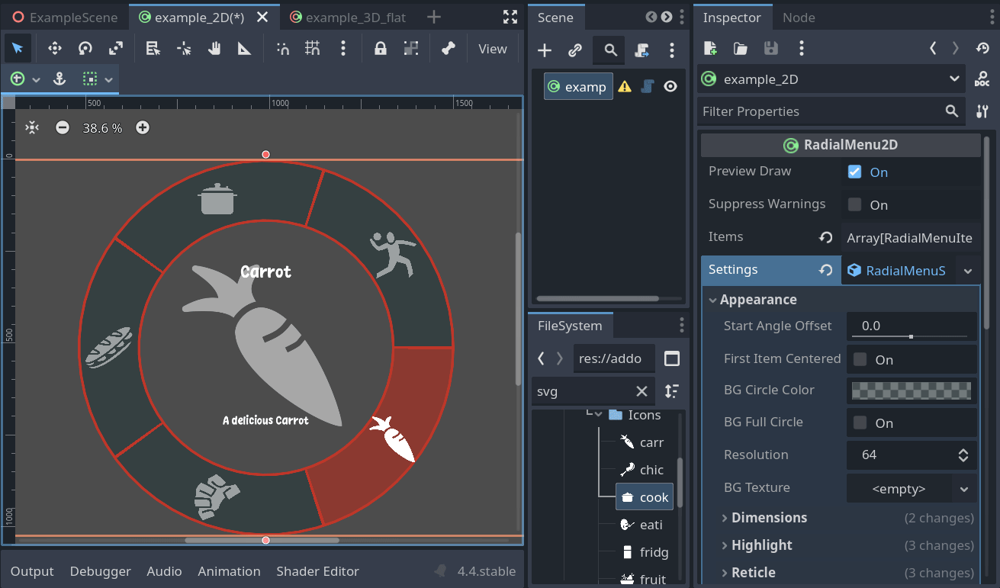
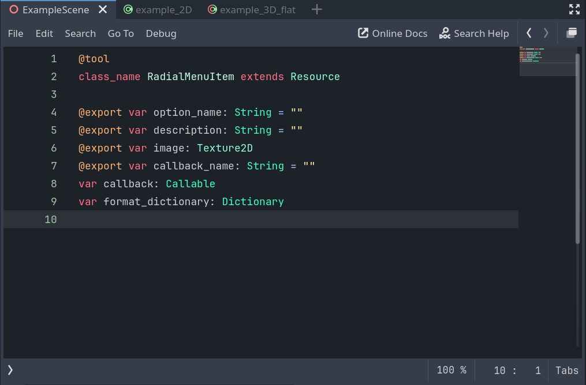

  

# iRadial Menu - Component for Godot 4.x

A Godot 4 addon that provides customizable radial menu components for your projects. Easy drag and drop nodes for 2D and 3D scenes. Conveniently packed settings and menu items list. Use it as is, or dive in and customize the code to your need. A special care has been given to the code to feel more intuitive to touch and modify.

## Features

- Fully customizable radial menus.
- Support for dynamic menu items using the `RadialMenuItem` resource.
- Easy integration into existing projects.
- Adjustable radius, angles, and item spacing.
- Works seamlessly with Godot 4's scene system.
- Includes a 3D version (`RadialMenu3DFlat`) for projecting radial menus in 3D space.
- Signals for selection, cancellation, and hover changes.

## Installation

1. Download or clone this repository, copy the content of `addons/` into your Godot project's `addons/` folder.
2. Enable the addon in your project settings under `Project > Project Settings > Plugins`.
3. You can now use the RadialMenu Nodes.

## Usage

### Quick Start

1. Add a `RadialMenu2D` or `RadialMenu3DFlat` node to your scene.
2. Create an array of `RadialMenuItem` resources and assign it to the `items` property.
3. Customize the menu's appearance and behavior using the `RadialMenuSettings` resource.
4. Use the `selected`, `selection_changed`, and `canceled` signals to handle user interactions.
5. Open the built-in documentation and search for `RadialMenu2D` to get a better understanding of it's properties and methods.
6. The `RadialMenu2D` code is meant to be modified and adapted to your project needs.

### RadialMenu2D

1. Add the `RadialMenu2D` node to your scene.
2. Create an array of `RadialMenuItem` resources, each representing a menu item. Configure their properties such as `name`, `description`, `texure`, and `callback_name`.
3. Assign the array of `RadialMenuItem` resources to the `items` property of the `RadialMenu2D` node.
4. Customize the appearance and behavior of the radial menu by creating and assigning a `RadialMenuSettings` resource to the `settings` property of the `RadialMenu2D` node.
5. Both the `items` and `settings` properties are exposed in the Godot inspector, allowing you to edit them directly in the editor or via code.
6. Use the signals `selected`, `selection_changed`, and `canceled` to handle user interactions with the menu.
7. Using the inspector, you can preview the radial menu in the editor if you enable the `preview_draw` property.

### RadialMenu3DFlat

1. Add the `RadialMenu3DFlat` node to your 3D scene.
2. Configure the `items` property with an array of `RadialMenuItem` resources.
3. Customize the 2D appearance of the menu using the `settings2D` property, which accepts a `RadialMenuSettings` resource.
4. Adjust 3D-specific properties such as `ui_resolution`, `ui_dimension`, `distance_from_camera`, and `tilt_with_mouse` to control how the menu is projected in 3D space.
5. Use the `popup` and `close_popup` methods to display or hide the menu in the 3D world.

### RadialMenuItem

The `RadialMenuItem` resource represents a single menu item. It includes the following properties:
- `name`: The name of the menu option. _exposed in the inspector_
- `description`: A description of the menu option. _exposed in the inspector_
- `texture`: A texture to display for the menu item. _exposed in the inspector_
- `callback_name`: The name of the callback function to invoke when the item is selected. _exposed in the inspector_
- `callback`: A direct callable reference to execute when the item is selected. Automatically called on selection.

### RadialMenuSettings

The `RadialMenuSettings` resource allows you to configure the appearance and behavior of the radial menu. Key properties include for example:
- `start_angle_offset`: Adjusts the starting angle of the menu.
- `bg_circle_color`: Sets the background color of the menu.
- `hover_color`: Defines the color of the hovered menu item.
- `reticle_outer_enabled`: Enables or disables the outer reticle.
- `item_auto_size`: Automatically sizes menu items based on the menu dimensions.

For detailed examples, check the `examples/` folder in this repository.

## Compatibility

This addon is designed for Godot 4.x. It may not work with earlier versions of Godot.

## Contributing

Contributions are welcome! Feel free to open issues or submit pull requests to improve this addon.

## License

This project is licensed under the MIT License. See the [LICENSE](LICENSE.md) file for details.

## Acknowledgments

    

Special thanks to the Godot community for their support and inspiration.
A big thank you to the Twitch community for their support, feedback, and encouragement during the development of this project.

- Addon beta test and feedbacks:

    

- The 2D part of the `RadialMenu2D.gd` class is based on the work of [diklor](https://github.com/diklor/advanced_radial_menu).

- Thanks to Andrea "SirAeron" Di Bartolo, for providing 3D model assets for the example scene. Check out his portfolio on [Artstation](https://www.artstation.com/andreadbx).

- Some of the food item assets are from the [Food Kit](https://kenney.nl/assets/food-kit) by [Kenney](https://kenney.nl/).  

    

- This plugin was developed for the [Radial Menu Game Jam #1](https://itch.io/jam/radial-menu-game-jam-1) hosted on itch.io.  

    

### Featured Game Development Streamers

In the example scene there is an _easter egg_ (the main menu) where you can have a look at the face of all the following game-dev streamers

Cute plush:

